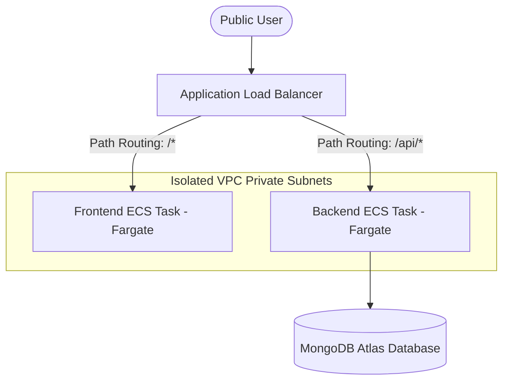

# Service Connect Cloud Platform

Service Connect is a modern full-stack platform that connects skilled service professionals with customers. This repository contains the complete application code along with its production-grade container setups, automated CI/CD pipelines, and Infrastructure as Code (IaC) configurations for deploying to AWS.

---

## 🏗️ Architectural Overview

The application is structured into a containerized local development stack and a serverless AWS production cloud stack.



---

## 🛠️ Tech Stack & DevOps Ecosystem

### 💻 Application Tier
*   **Frontend**: React (v18) with TypeScript, Vite build tool, Tailwind CSS, Zustand state management, and Socket.io Client for chat.
*   **Backend**: Node.js with Express & TypeScript, Mongoose ODM, Socket.io real-time chat, JWT authentication, and Stripe payments.

### 🐳 Containerization & Ingress
*   **Multi-Stage Dockerfiles**:decourple build dependencies from runtime environments. Front-end serves from a lightweight Nginx Alpine base (~18MB). Backend runs Node Alpine via a secure, unprivileged `node` user.
*   **Nginx Ingress Proxy**: Directs local traffic on port 80, proxying client requests, API paths (`/api`), and WebSockets, bypassing all browser-side CORS configuration issues.
*   **Docker Compose**: Manages the local multi-container network with healthy dependency pings (ensuring Node waits for MongoDB).

### 🚀 CI/CD Automation (GitHub Actions)
*   **Workflow Runner**: Triggered on push to the `main` branch.
*   **Compilation**: Builds multi-platform container images (AMD64 & ARM64) utilizing Docker Buildx and QEMU cache mounts to minimize compile times.
*   **Image Registry**: Automatically pushes compiled packages directly to Amazon ECR.

### 📐 Infrastructure as Code (Terraform & AWS)
All cloud resources are programmatically managed via **Terraform** inside `terraform/` using the following AWS services:
*   **Amazon VPC**: Custom network with 2 public subnets (for the ALB) and 2 isolated private subnets (for Fargate tasks).
*   **AWS Fargate**: Serverless container host eliminating VM OS administration.
*   **Application Load Balancer (ALB)**: Ingress gateway directing public HTTP paths.
*   **Amazon ECR**: Private container registry.
*   **Amazon S3**: Secure object storage bucket with strict public access blocks.
*   **Amazon CloudWatch**: Gathers container console output for log streaming and monitoring.
*   **AWS IAM**: Manages narrow, task-specific execution permissions.

---

## ⚙️ Getting Started (Local Development)

### Prerequisites
*   [Docker Desktop](https://www.docker.com/products/docker-desktop/) installed and running.
*   WSL2 Backend enabled (for Windows systems).

### Single-Command Start
Navigate to the root workspace and run:
```bash
docker compose up --build
```
This command automatically:
1.  Pulls the official MongoDB database image.
2.  Compiles the multi-stage backend and frontend Docker layers.
3.  Boots the Nginx Ingress gateway on port 80.

The application will be accessible at:
*   **Local Gateway**: [http://localhost](http://localhost)
*   **Local API Server**: [http://localhost/api](http://localhost/api)

---

## 📐 Cloud Infrastructure Management (Terraform)

The AWS infrastructure is fully modular. To inspect or deploy changes:

### 1. Authenticate with AWS CLI
Configure your credentials:
```bash
aws configure
```

### 2. Initialize and Apply
Navigate to the infrastructure directory:
```bash
cd terraform
terraform init
terraform plan
terraform apply
```

### 3. Clean-Up
To safely tear down all provisioned cloud resources to prevent billing charges:
```bash
terraform destroy
```

---

## 📂 Project Directory Structure

```text
├── .github/workflows/    # GitHub Actions CI/CD pipeline automation
├── backend/              # Node.js TypeScript API (Express & Socket.io)
│   ├── Dockerfile        # Backend multi-stage configuration
│   └── src/              # Source code (models, routes, socket controllers)
├── frontend/             # React Vite Client (Tailwind & TS)
│   ├── Dockerfile        # Frontend Nginx Alpine server setup
│   └── src/              # App views, components, and assets
├── nginx/                # Local Ingress configuration
│   └── nginx.conf        # Local API, static files, and websocket rules
├── portfolio/            # Rebuilt React + Vite + Tailwind Portfolio website
└── terraform/            # Infrastructure as Code configuration files
    ├── alb.tf            # Load Balancer, Listeners, and Target Groups
    ├── ecr.tf            # Container Registry definitions
    ├── ecs.tf            # Fargate Tasks & Cluster orchestration configs
    ├── s3.tf             # Secure S3 media assets bucket
    ├── security.tf       # Port rules and VPC security groups
    ├── variables.tf      # HCL Project configurations
    └── vpc.tf            # Networking, Subnets, and NAT configs
```

***

*Developed by Shibin CK — Entry-level Cloud & DevOps Engineer focused on hands-on infrastructure automation.*
